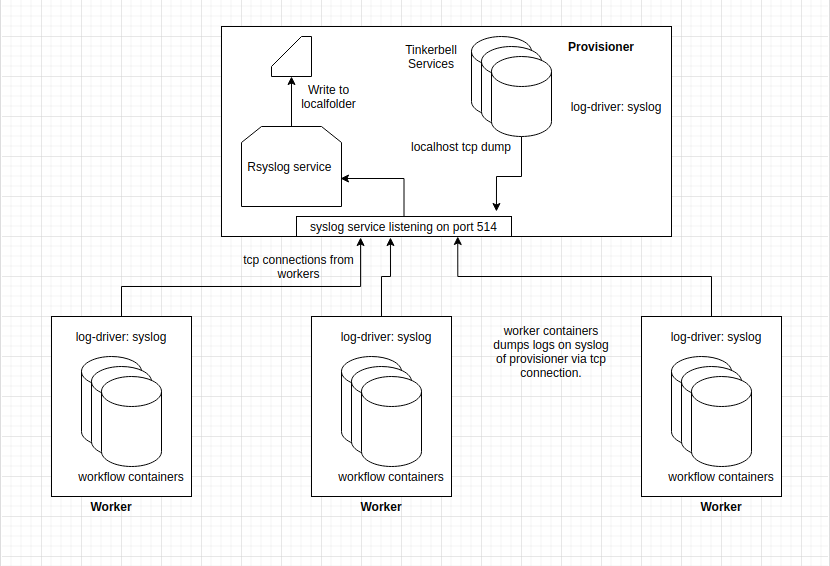

## Summary:

Centralized logging framework for Tinkerbell microservices.

## Overview:

- Tinkerbell will have the feature of centralized logging.
- Logging feature should be implemented in such a way that a user can modify the type of logging (rsyslog or fluentbit) as per his needs. This may require the user to make additional changes on his end to enable that feature.

## Goals:

Goals cover the feature Details:
- Tinkerbell will have the feature of centralized logging of microservices.
- Logging feature should be very lightweight i.e without additional microservices.
- We want to let the user decide the logging feature they would have, and they should have the flexibility to build something on the top of existing logging framework.
- The feature should suffice day 0 configuration and beyond, unless the user decides to extend the implementation of it.
- Centralize logging should be easy to deploy, configure and modify.

## Content:

- We want a centralized logging framework which leverages existing services in Linux platform like syslog, journald etc.
- This framework should be lightweight.
- This logging framework can be configured as a part of Tinkerbell deployment.
- This configuration can be applied over Microservices of Provisioner and Worker nodes.
- It is also good to have a way where the user can configure the log-server address and types of log drivers. It can be done using the workflow template or some other configuration files, as mentioned below in "Suggestions".
- For this RFD log-server address can be a folder in the provisioner. If the user wants he can mount to a separate docker container.
- We would like this framework to have a way where a user change the logging configuration like log-server address or log-driver. For example let say, if the default log-driver is `syslog` then the user can configure it to`fluentbit`, add some other services like ELK and kibana to extend the framework.

## Progress:

This implementation of framework has been tested with rsyslog with a POC and been discussed in-depth within the Packet and Infracloud team.

## Suggestions:

- By default, the logging feature can be supported by rsyslog which is built on the top of syslog.
- We want to ensure at a basic minimum there is a centralized logging framework which exists for Tinkerbell. In order to have a generic implementation of configuring log-drivers below are some proposals.
-) How to make action containers run with logging drivers.
a) Place the logging details inside the workflow template.
```
	version: "0.1"
	name: hello_world_workflow
	global_timeout: 600
	tasks:
	  - name: "hello world"
	    worker: "{{.device_1}}"
	    actions:
	      - name: "hello_world"
		image: hello-world
		timeout: 60  
	logging:
	  type: syslog  # log driver
	  config:
	    syslog-address : tcp://192.168.1.1:514
	    tag: "container_name/{{.Name}}"
 ```

 - This will ensure all the worflow action containers have consistent way of logging informations.
 - logging configuration would be specific to workflow containers.


b) Host level configuration.
- We can have a file for host level configuration. This will set environment variables which can be used in action.go while creating the containes.
- This will have a way where all the workflow template will have the common logging framework.
- Problem
    - Design issue: logging here is specific to action docker containers. So having them in the workflow template makes more sense other than in separate config file.
    - while maintaining multi-node cluster, logging configuration can vary.
    - updating the logging configuration.


c) Workaround
   - Have configuration defined in action.go when the action container is created. This will ensure we have the bare centralized framework ready.
   - Challenge:  
     - change in implementation when changes are done in provisioner. Like, moving the whole infrastructure on a private network.

## System Context Diagram

Example with rsyslog



[ryslog_implementaiton_details](rsyslog_implementation_details.md)

[Provisioner changes for rsyslog](rsyslog_provisioner_configuration.md)

[Docker-Compose file Changes](docker-compose.yml)

[User Guide](user_guide.md)

## Future roadmap:

As a part of roadmap implementation, certain changes in the existing framework would be required to bring below proposals onboard.

1) Provisioner/Worker configuration
   Pushing logging configuration on the nodes via some template or config file.

2) Centralized logging in Private infrastructure of Provisioner

3) Fault tolerance in logging.
- Handling of scenarios where communication can break over network or nodes can go down.
- Handling of scenarios where there can be distributed provisioner having services running across multiple nodes.

4) Log files structure:
- Worker container Files to have workflow Id. In the current framework, this can be done. Changes would be required to attach id of workflow in the name of worker action containers.
- Files for each node will be placed in the respective directory on logging server.

6) Implementation with fluentbit and other logging drivers:  
* Separate doc on how rsyslog, fluentbit would work.


## Documentation:

- Doc on working of logging framework with rsyslog implementation will be added in the first release.


## References:

https://docs.docker.com/config/containers/logging/syslog/#options
https://man7.org/linux/man-pages/man8/rsyslogd.8.html
