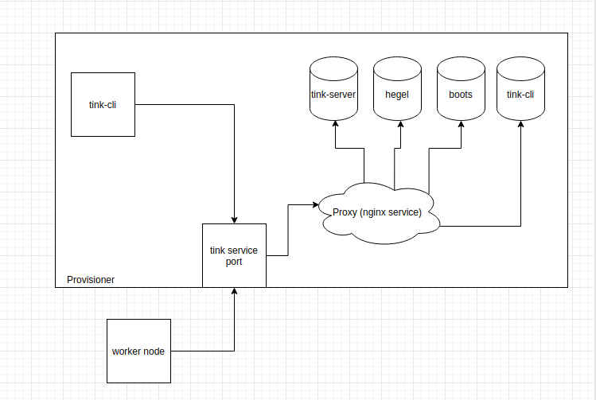

## Summary:

Currently, all the services in provisioner are accessible from outside (i.e via worker). Even in some implementation, ex tink #195, worker have full access (Read+write) tink-server via tink client. This leads to the possibility that worker can alter the behaviour of tink-server.

## Goals:

- Move all Tinkerbell services in private Network and expose them via proxy on a given port.

## Content: 

a) move all the tink-services in a private network. All the services should be accessible only via proxy.
b) worker should only have read access. I have suggested in #195, that we should dynamically add worker_id to every grpc call made from worker node. With validation of this worker_id with worker_id present in the query, it would be ensured, the worker does not have access to attributes of other workers.
c) tink-server should not expose the core method (like, GetWorkflowContexts,) directly to the worker. Instead, tink-server should expose wrapper functions, which would internally call the respective methods along with additional validations as mentioned in the snippet below.
```
// GRPC methods
func wrapper_to_get_workflow(){
	   validate worker_id()
	   call GetWorkflowContexts() // or other methods
	   return
	} 

// call form worker node
data = wrapper_to_get_workflow()
```
d) Proxy service can be implemented using nginx service of the Tinkerbell.

## Progress:

- As of now all of the services are accessible using Tinkerbell IP since all of them are exposed to given ports. 
- The worker can have full access to modifying the attributes inside tink-server using GRPC methods. 

## System Context Diagram


