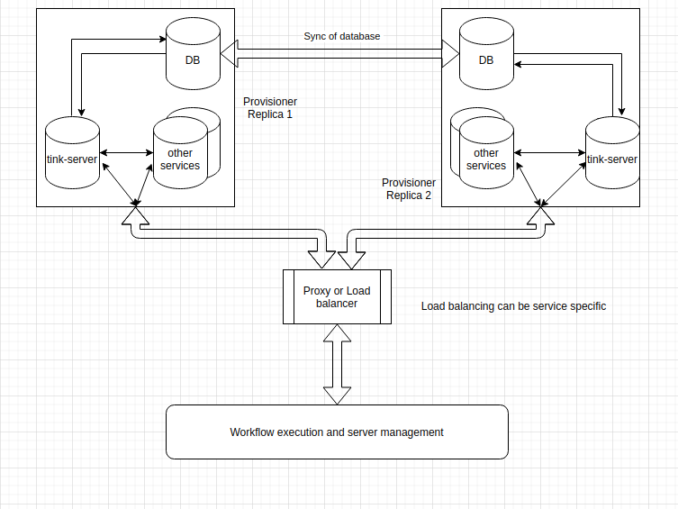

## Summary:

This RFD proposes to have a resilient framework for Tinkerbell Provisioner.

## Goals:

- Bring resiliency in Tinkerbell. 
- Tinkerbell as a setup should be highly available.

## Content: 

- In the current implementation, during workflow execution, if the connection between provisioner and worker breaks then 
	- the workflow execution fails.
	- provisioner is in a state where can microservices not be accessed.
	- tink-cli also doesn't work.
	- workflow state can not be recovered.
	- provisioner as of now also does not recover.
	- Tinkerbell as a bare metal server manager also fails. 
- Above points entails Tinkerbell is not reliable at this state. 
- The connection between provisioner and worker machine can break if (we will assume workflow execution is in the process) 
	- provisioner is rebooted.
	- Network failure, resulting in communication drop between provisioner and worker machines.
	- system or hardware failure of provisioner machine due to process, memory etc.
	- Fire cut, Rat cut (least possible scenarios) 
- On the occurrence above events, Tinkerbell services will not be able to recover and all the data or workflow execution will be lost. 
- We would like to have a framework where Tinkerbell as a solution is fault-tolerant.
- Tinkerbell as a server manager and its core services are able to recover from failure with eventual consistency. 
- Also, most of the core services are managed by provisioner. So, it will be good to have a framework where provisioner is highly available. It can be a multinode provisioner solution with active-active or active-passive implementation.
- Let's take an example of 2 Node cluster:
	- Active-Active:
	  - All the services running on both the nodes and both the nodes have active service.
	  - Nodes would need logic to sync among themselves. 
	  - Design for communication between prov. and the worker would be needed. 
	  - How the request would be routed from worker to prov. 
	  - How prov. will send a reply to the worker.
	- Active-passive.
	  - All services running on both the node but only one node have active service.
	  - Nodes would need logic to sync among themselves. 
	  - Communication between be between active prov. and the worker. Passive prov. can be synced eventually. 

- The Provisioner services should be partition tolerant during network failures or communication failure between provisioner nodes.
- Additional logic would be required to sync services running inside provisioner nodes as mentioned above.
- A separate machine to place an L3/L7 Load balancer or proxy would be required. This feature is required communication between active-active multi-node provisioner and the worker node.

## Problems and Suggestions:

1) How does worker communicate with provisioner?
-  The worker will communicate to the load balancer (or proxy) and the request will be routed to a replica of provisioner.
-  Sessions need to be maintained inside Load balancer so that different requests of worker goes to the same replica of provisioner. 
-  How sessions can be maintained with the latest changes of GRPC streams, requires some investigation. 

2) Which services require sync among it replicas?
-  Currently, at least DB service needs a sync logic in backend. 
-  This can be achieved by having daemon agents running in both nodes and syncing the database. 

3) What happens when a request of a worker is being processed by a provisioner's replica and that replica goes down?
-  If DB is in sync then the state of the provisioner will be consistent. 
-  Additional logic inside load balancer would be required to ensure when traffic is routed to another replica, then contexts associated with the request are also changed. Workflow execution should continue will another replica now. 

4) How will boots DHCP request work with a load balancer?
-  The worker will request an IP from DHCP. Currently, GRPC request is made to get IP from the tink-server using the Provisioner IP. So, this should work the same way. 
-  Additional logic of working with GRPC request on load balancer would be required. 

## System Context Diagram

