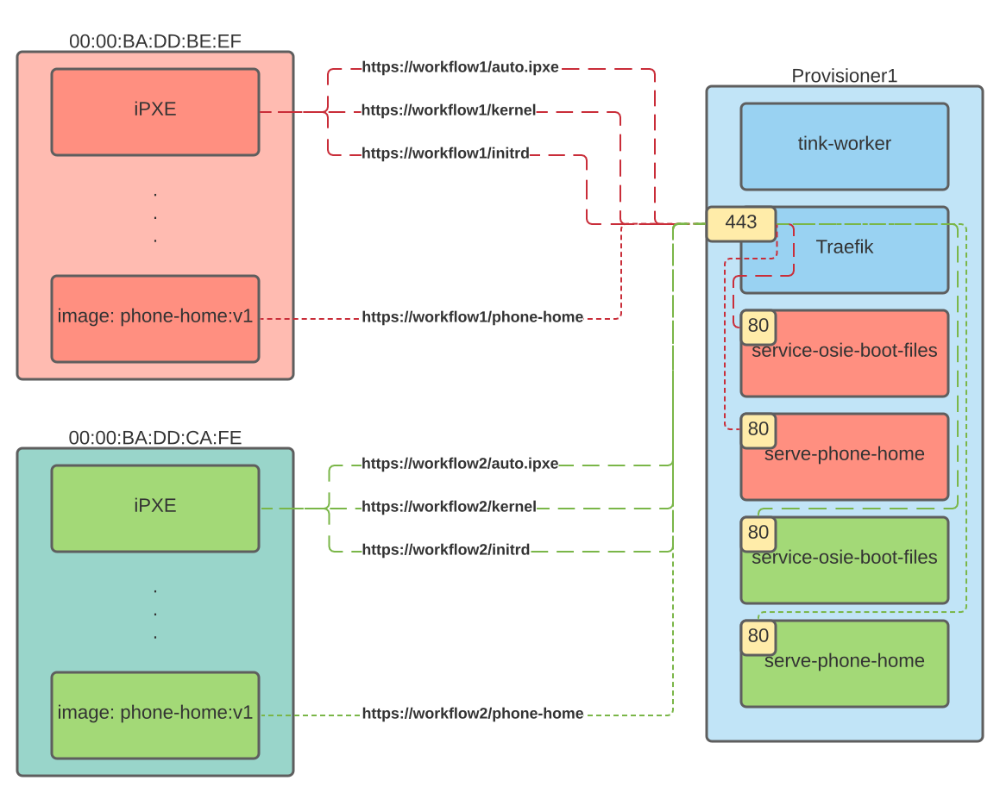

## Summary

HTTP routing for services started by tink-worker running on "provisioner" machines.

## Goals and not Goals

#### Goal

A way for provisonee/target machines to make HTTP(S) requests to a service that is defined as part of its workflow.

#### Non Goal

A way for external services to make in bound requests into the target machine.
This may be added in the future if demand exists.

## Content

The final piece that will enable [0013].
This is the proposed method to make requests to services defined in the workflow ([0014]).
The url will be defined in the workflow service action.
I'm not really sure if as a label or a well-defined attribute.

#### Explicit Labels

```yaml
version: "0.1"
name: ubuntu_provisioning
global_timeout: 6000
services:
  - name: serve boot files
    worker: {{provisioner1}}
    image: osie-boot-files-server:v1.0.42
    labels:
      - "traefik.http.routers.myrouter.rule=Host(`{{workflowid}}.workflows.tinkerbell.local`)"
      - "traefik.http.routers.myrouter.rule=Path(`/kernel`)"
      - "traefik.http.routers.myrouter.rule=Path(`/initrd`)"
      - "traefik.http.routers.myrouter.rule=Path(`/modules`)"
      - "traefik.http.routers.myrouter.rule=Path(`/auto.ipxe`)"

  - name: password receiver
    worker: "{{provisioner1}}"
    image: password-receiver:v1.0.42
    labels:
      - "traefik.http.routers.myrouter.rule=Host(`{{workflowid}}.workflows.tinkerbell.local`)"
      - "traefik.http.routers.myrouter.rule=Path(`/key`)"
      - "traefik.http.routers.myrouter.rule=Path(`/password`)"

tasks:
  - name: os-installation
    worker: {{.device_1}}
    volumes:
      - /dev:/dev
      - /dev/console:/dev/console
      - /lib/firmware:/lib/firmware:ro
    environment:
      MIRROR_HOST: <MIRROR_HOST_IP>
    actions:
      - name: disk-wipe
        image: disk-wipe:v1.0.42
        timeout: 90
      - name: disk-partition
        image: disk-partition:v1.0.42
        timeout: 600
        environment:
          MIRROR_HOST: <MIRROR_HOST_IP>
        volumes:
          - /statedir:/statedir
      - name: install-root-fs
        image: install-root-fs:v1.0.42
        timeout: 600
...
```

This leaves the url labeling up to the operator/workflow definer.
This is obviously the least work for tink-worker, while offering the operator maximum options.
This is really just about labels though, not _really_ much in the way of HTTP routing.
Just allowing appliation of labels may be good enough.

#### Well Defined Attribute

```yaml
version: "0.1"
name: ubuntu_provisioning
global_timeout: 6000
services:
  - name: serve boot files
    worker: {{provisioner1}}
    image: osie-boot-files-server:v1.0.42
    urls:
      - https://{{workflowid}}.workflows.tinkerbell.local/kernel
      - https://{{workflowid}}.workflows.tinkerbell.local/initrd
      - https://{{workflowid}}.workflows.tinkerbell.local/modules
      - https://{{workflowid}}.workflows.tinkerbell.local/auto.ipxe

  - name: password receiver
    worker: "{{provisioner1}}"
    image: password-receiver:v1.0.42
    url:
      - https://{{workflowid}}.workflows.tinkerbell.local/key
      - https://{{workflowid}}.workflows.tinkerbell.local/password

tasks:
  - name: os-installation
    worker: {{.device_1}}
    volumes:
      - /dev:/dev
      - /dev/console:/dev/console
      - /lib/firmware:/lib/firmware:ro
    environment:
      MIRROR_HOST: <MIRROR_HOST_IP>
    actions:
      - name: disk-wipe
        image: disk-wipe:v1.0.42
        timeout: 90
      - name: disk-partition
        image: disk-partition:v1.0.42
        timeout: 600
        environment:
          MIRROR_HOST: <MIRROR_HOST_IP>
        volumes:
          - /statedir:/statedir
      - name: install-root-fs
        image: install-root-fs:v1.0.42
        timeout: 600
...
```

This is more agnostic, but would require `tink-worker` to have knowledge about ingress/proxy that it doesn't otherwise need.
We have no way to specify the proxy and would have to set that up.

I happen to be in favor of labels, actually.
I named this proposal "HTTP Routing For Services" instead of "Allow Specifying Labels" so that we have a frame of reference for the proposal.

Questions:

1. Should we allow arbitrary hostnames?
   1. My gut feeling is no, but if DNS works out then why not?

[0013]: https://github.com/tinkerbell/proposals/pull/18
[0015]: https://github.com/tinkerbell/proposals/pull/20

## System-context-diagram

The following diagram provides the example of 2 "target" machines making use of http services on the "provisioner1" machine.


