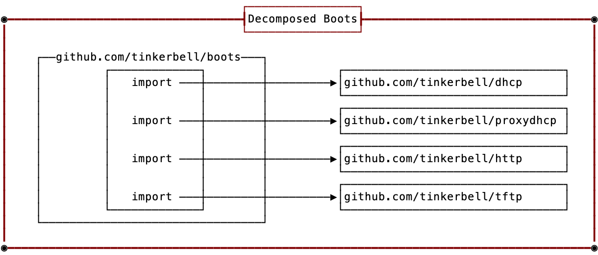

## Summary

Decompose Boots functionality into discrete independent libraries and make Boots import the libraries.
Why? Boots is burning for clearer design and scope, organization and structure, and flexibility of operation.
Discrete libraries will provide clarity of scope and allow for Boots to focus on flexibility of operation.

## Goals and not Goals

Goals

- Make Boots codebase easier to reason about, maintain, and contribute to
- All high-level functionality (DHCP, TFTP, ProxyDHCP, HTTP)  in Boots can be enabled/disabled at runtime
- Add proxyDHCP functionality
- Libraries are single-purpose and highly tested codebases
- Existing interactions with all other existing Tinkerbell services are not affected
- Create a Boots that is comparable to dnsmasq in terms of a single binary to PXE boot a machine

Non-Goals

- modifying architecture, code or APIs outside of the PXE phase, i.e. Tink server, hegel, pbnj, etc.

## Content

Boots does way too many things.
Here is a short list of just what I'm aware of.

- dhcp server
- pxe, tftp, http server
  - custom/bespoke kernel cmdline values: example: eclypsium
  - custom installations
    - custom ipxe
    - nixos
    - vmware
    - coreos
    - rancher
- syslog server
- hardware discovery ([/hardware-components](https://github.com/tinkerbell/boots/blob/70440b27cb1559770ef485596b9c3a4a253a4dfc/http.go#L82))
- phone home functionality ([/phone-home](https://github.com/tinkerbell/boots/blob/70440b27cb1559770ef485596b9c3a4a253a4dfc/http.go#L69))
- failure/event system ([/problem](https://github.com/tinkerbell/boots/blob/70440b27cb1559770ef485596b9c3a4a253a4dfc/http.go#L71))
- business rule engine for who and what should be allowed to PXE (https://github.com/tinkerbell/boots/blob/70440b27cb1559770ef485596b9c3a4a253a4dfc/http.go#L106)
  - metadata reader - talks to cacher or hegel or tink server

It it also full of many Equinix Metal only specific use-cases.

*__names are for demonstrating the layout only__*

Historically and up to today Boots has struggled mightily with code design, scope, structure, and organization.  In-place refactors have proven inadequate or failed, not being able to achieve clean design, code, scope, structure, and organization. In order to overcome this and achieve the goals stated above, we need a new way to enable this refactor. Also, the Tinkerbell community has long been asking for clearer boundaries between things like building iPXE binaries from source and simple non iPXE related code changes. The idea is to move discrete functionality currently in Boots into their own libraries and codebases. Right out of the gate this provides clear definitions of scope, which is a base building block for having a clean design, structure, and organization.

This discrete functionality will be broken down into the following areas:
- DHCP
  - Handle serving general DHCP requests
  - RFC  1534, 2131, and 2132
- proxyDHCP
  - Handle serving PXE client requests
  - RFC 4578, PXE specification
- TFTP
  - Handle serving iPXE binaries
  - RFC 1350
- HTTP(S) dynamic file share
  - Handle serving iPXE script(s) (the same way auto.ipxe is currently served)
    - `auto.ipxe` is the user-facing name for all existing custom ipxe scripts. This library will need to be able to handle the dynamic update of this file for existing custom ipxe scripts, like VMware.

Each library will contain a clear and simple API for handling its purpose. Each API will contain a default handler, that can be substituted, that should work for at least 80% of the use-cases. These libraries should handle implementing the logic for the RFCs they support, not just be building blocks. For example, github.com/packethost/dhcp4-go allows us to read, write, and build DHCP packets but does not make sure we implement the DHCP RFCs correctly.

The flexibility of operations goal means that Boots must be built with a high level of flexibility to be able to enable/disable any functionality at runtime. and be able to interoperate with any externally available pieces. I.e. bring your own DHCP, or your own TFTP, etc. This flexibility will allow operators the ability to run Boots all together or in separate parts.  This provides operations the ability to address concerns like safer updating and scaling at runtime. 

The Syslog receiver server (for receiving Syslog messages) and webhook server functionality (for miscellaneous endpoints like “/phone-home”, install status events, etc) will not be incorporated into the new Boots design. Nor will serving custom HTTP endpoints for things like VMware kickstart scripts. Additional external services will be required to handle this functionality. These are being removed because

- They have clouded the scope of Boots
- They add to the size of the already large Boots failure domain
- They are only very specific to many Equinix Metal related needs and how things are done internally
- Syslog server doesn’t provide any additional value from just running one externally

Test plan:

- Functional:
  - Existing Boots test code integrated
  - Update the Tinkerbell sandbox, run some manual provisioning tests.
- Unit:
  - All libraries have at least 75% unit test coverage

## Trade Offs

- more repositories add to the development overhead to maintain
- time and effort to make the changes

## Alternatives

- Move all high-level functionality into their own services/binaries/repositories. This allows for greater flexibility in operating Boots but adds complexity in its operation as well. Coordinating multiple binaries are not as friendly of an experience if just getting started.
- Refactor Boots to have a more clear structure of separation of concerns.
Do this along the 6 discrete functional areas described in the Design Details section but don’t break out each functionality into its own library.
Provide the ability to enable or disable any combination of functionality.
One downside is that we have a poor track record of clear code design, scope, organization, and structure.
Code reuse and “DRY” (don't repeat yourself) techniques would need to be carefully considered to avoid convoluting scope, separation of concern, and cognitive load for understanding.
