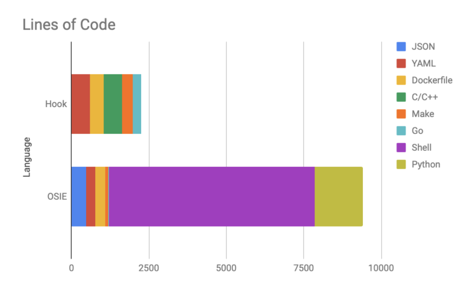

## Summary

Deprecate and archive the tinkerbell/osie repository

## Background

OSIE is the Operating System Installation Environment. OSIE was created by
Equinix Metal and predates the Tinkerbell project. It contains three primary components,
all of which have had their functionality replaced within Tinkerbell:

* A live Linux environment for executing workflows ⟶ hook
* The osie-runner program to execute jobs ⟶ tink-worker
* The collection of containerized provisioning scripts ⟶ workflows

Tinkerbell only ever made use of the first component, the Linux environment.
In September 2021, the Tinkerbell sandbox switched its default Linux environment
from OSIE to Hook, completing the transition of the OSIE components.

This tech debt is visible when you look at the code footprint of the two repositories
side-by-side:

While OSIE's model looks very different from Tinkerbell today, it played a vital
role in inspiring and informing the current Tinkerbell stack.

### Goals

* Bring the Tinkerbell community together behind a single live Linux environment
* Eliminate technical debt
* Eliminate confusion about which Live environment users should adopt

### Non-Goals

* Eliminate the ability for users to choose their own live Linux environment

## Proposal

* Update the tinkerbell/osie repository state from `Experimental` to `Deprecated`.
* Commit to only accepting bug fixes for the first 60 days.
* After 60-days, set the tinkerbell/osie repository to `archived` (read-only).
* Allow users to continue to maintain their own local OSIE fork ad infinitum.

## Alternatives

* Continue to maintain both Hook and OSIE
