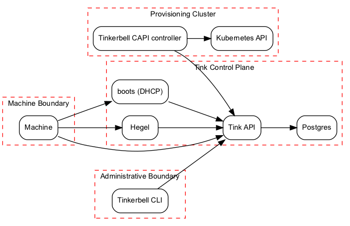
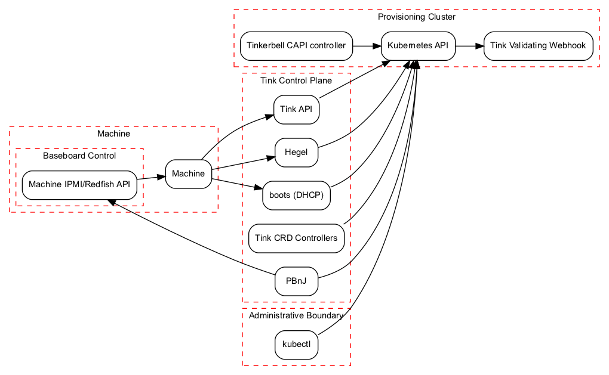

## Summary

This is a proposal to operate Tinkerbell as an application on top of the [Kubernetes Resource Model][krm] (KRM).
It is a rearchitecture of the 'control plane' backend, and leaves the 'data plane' components of Tink workers and actions unchanged.
It will require a transition period where Postgres and the full Tinkerbell API will be supported, then deprecated, then removed.
The four separate stages are:
1. Support full existing API and Postgres backend
2. Support full existing API and Postgres backend, as well as K8s resource model (KRM)
3. Deprecate most of the existing API and Postgres backend.
  Continue to build out and support KRM
4. Remove existing non-worker APIs, only support KRM

[krm]: https://github.com/kubernetes/community/blob/master/contributors/design-proposals/architecture/resource-management.md

## Goals and not Goals

Goals:
* **Compatibility with existing Tink workers, workflow execution, and actions.**
* **More easily support non-request serving controllers in Tinkerbell.**
  In this architecture, controllers like PBnJ could leverage Kubernetes primitives like [Custom Resource Definitions][crds] (CRDs), [WATCH APIs][watch], and [Field Management][fm] to complete workflow steps.
* **Reduce the security surface of the Tinkerbell API.**
  Tinkerbell is a high-value component of data center infrastructure, so protection of DHCP infrastructure, BMC/IPMI management, needs to be treated as such.
  Implementing multiple authorization modes is a non-trivial task.
  The fewer APIs, and authorization options, and lines of code that exist, the fewer opportunities there are for security issues to arise.
* **Support a highly-available architecture.**
  Postgres is a fantastic database, but managing high-availability with graceful failover is not trivial.
  Using an alternative data store that better supports failure will better help operators to have higher availability and not require downtime for upgrades or failover.
* **Add KRM support for existing components**.
  Hegel, Boots, and Tinkerbell API will be modified to use Kubernetes as the datastore with a feature flag
* **Support migration of existing installations.**
  Migration tooling and documentation will be provided for existing Workflows, Hardware, and Templates stored in Tinkerbell.
  Migration should be as straightforward as:
  * Creating Tinkerbell CRDs in the Kubernetes API
  * Running a provided migration command
  * Restarting each Tinkerbell component targeting Kubernetes with a feature flag enabled

Non Goals:
* **Implement attribute-based authorization in Tink API.**
  This is intentionally descoped from this proposal and can be implemented in a separate proposal.
* **Require Tinkerbell to be operated as pods inside Kubernetes.**
  The Kubernetes API will become a dependency of Tinkerbell, but that API could exist in a cloud provider or on-premise.
* **Require the use of Cluster API ([CAPI][capi]).**
  The [Tinkerbell CAPI provider][capt] (CAPT) is mentioned in this proposal only for reference of a known Tinkerbell client.
  Implementation of this proposal will necessitate changes in CAPT, but that is not the core motivation for this proposal.
* **Implementation of PBnJ as a Kubernetes controller**
  This can be implemented in a separate proposal.
* **Make the Tink worker a client of Kubernetes.**
  Kubernetes doesn't natively support robust attribute-based identities for non-node identities.
  For example, if the Tink worker were a Kubernetes client, it would not possible with Kubernetes RBAC to ensure that a particular worker can only view or mutate hardware data or workflows that relate to that worker.
  It does have the [Node Authorizer][node-authorizer], but that is specific to authorization of Kubelet communication to the Kubernetes API.
* **Provide a zero-downtime migration experience.**
  Migration tooling and documentation will be provided, but migrating in-progress workflows is out of scope.
* **Implement a proxy interface for the legacy API.**
  Existing APIs that do not support worker actions will not be served when the Kubernetes backend is enabled.

[crds]: https://kubernetes.io/docs/concepts/extend-kubernetes/api-extension/custom-resources/
[watch]: https://kubernetes.io/docs/reference/using-api/api-concepts/#efficient-detection-of-changes
[fm]: https://kubernetes.io/docs/reference/using-api/server-side-apply/#field-management
[capi]: https://cluster-api.sigs.k8s.io/
[capt]: https://github.com/tinkerbell/cluster-api-provider-tink

## Content

### Architectural Motivation

Tinkerbell is very flexible and uses standard protocols like PXE, DHCP, and HTTP to support provisioning hardware.
In order to support more features, more API machinery work will be required.
Listed below are some of the contributing architectural motivations.

* Streaming updates to clients is difficult with the current database
* Multiple-worker workflows will require numerous API changes
* There is no authorization in the Tinkerbell API today.
  In order to support a least-privilege access model, several new authorization modes would need to be supported.
  Implementation of such robust authorizations is non-trivial, and would require extensive initial design work.
  * An attribute-based authorization method for Tink workers.
    At the time of writing, any Tink worker is authorized to list all hardware data, including possibly sensitive metadata for other hardware.
    Today, the Tinkerbell Cluster API (CAPI) provider stores machine CA private key data in Tinkerbell hardware metadata.
    Ideally, some authorizer that could make decisions based on authentication identity would be used (The Kubernetes analog would be the [Node Authorizer][node-authorizer]).
    The authentication method in this model could be a network identity, a TPM, or some other bootstrapped authentication credential.
  * A role-based access method administrative clients.
  * Either a role-based access method, or some forwarding mechanism for passthrough clients like Boots and Hegel.
* Operating high-availability Postgres is non-trivial in many environments.

[node-authorizer]: https://kubernetes.io/docs/reference/access-authn-authz/node/

If we only focus on the Tinkerbell API clients as it exists in Q3 2021, the architecture looks something like the following:

[](.tink-arch-2.png)

In this proposal, all non-worker clients of Tinkerbell will become Kubernetes clients.

[](./tink-arch-2.png)

By using the Kubernetes API as the datastore, the motivations are addressed in the following ways:

* Kubernetes natively supports streaming watches for CRD types.
  Any process (PBnJ, Tink API, CAPT, etc) that need streaming updates can leverage Kubernetes Watches.
* Multi-worker workflows will require some backend changes, but that will be opaque to Tink worker clients.
* The only authorization mode required for the Tinkerbell API will be to support workers completing workflows
  * All Kubernetes clients (Boots, Hegel, PBnJ, etc) can have least-permission RBAC policies to limit the permissions for each respective client.
* High-availability Kubernetes and etcd can be delegated to a cloud provider or an on-premise Kubernetes cluster

### Components

**Tinkerbell API**: At the end of this process, the Tink API will become essentially a proxy for state changes to workflows from Workers.
It will require read access to Hardware, Workflows, and Templates, as well as write access to the status of Workflows to propagate state changes from workers.

The following [Tinkerbell Workflow APIs][wf-apis] are used by the Tink worker, and will remain.
After a deprecation period, all other Tinkerbell APIs will be removed.

[wf-apis]: https://github.com/tinkerbell/tink/blob/f6aa3930/protos/workflow/workflow.proto

```protobuf
service WorkflowService {
  rpc GetWorkflowContexts(WorkflowContextRequest) returns (stream WorkflowContext) {}
  rpc GetWorkflowActions(WorkflowActionsRequest) returns (WorkflowActionList) {}
  rpc ReportActionStatus(WorkflowActionStatus) returns (Empty) {}
  rpc GetWorkflowData(GetWorkflowDataRequest) returns (GetWorkflowDataResponse) {}
  rpc UpdateWorkflowData(UpdateWorkflowDataRequest) returns (Empty) {}
}
```

**Tink Worker**: The tink worker will remain unchanged.

**Tinkerbell Controller**: This new process will function as a set [Kubernetes Controllers][controllers] (state enforcement control loops) to govern the `.status` of Workflows, Templates, and Hardware.
This is separate from Cluster API (CAPI) controllers.

[controllers]: https://kubernetes.io/docs/concepts/architecture/controller/

**Kubernetes Webhook**: The [webhook][k8s-webhook] will validate and modify in-flight mutations of Tinkerbelll resourses.
This will be used to perform deeper create/update validations on fields beyond simple type validation.
This will also be useful to support schema updates when updating to new API versions.

[k8s-webhook]: https://kubernetes.io/docs/reference/access-authn-authz/extensible-admission-controllers/

**Boots**: Boots will become a client of Kubernetes, and will read Hardware data out of Kubernetes.

**Hegel**: Hegel will become a client of Kubernetes, and will read Hardware data out of Kubernetes.

**OSIE/Hook**: No changes are required in the assembly of Tink worker images.

**PBnJ**: PBnJ changes are out of scope of this proposal.
Future work in PBnJ will allow it to watch Workflows in the Kubernetes API and perform actions such as turning power on and off, mounting virtual media, and configuring BIOS.

**Kuberentes Cluster API Tinkerbell (CAPT)**: Modifications to CAPT are out of scope for this proposal, but will be necessary once this is implemented.

### User Experience

In order to use Tinkerbell, clients will interact with the Kubernetes API.
In order to provision a machine, the steps will be:

1. User creates a Hardware CRD object in Kubernetes.
   ```bash
   kubectl apply -f ./hardware.yaml
   ```
   This is analogous to the current `tink hardware push < hardware.json` command.
2. User creates a Template CRD object in Kubernetes.
   ```bash
   kubectl apply -f ./template.yaml
   ```
   This is analogous to the current `tink template create < template.json` command
3. User creates a Workflow CRD object in Kubernetes.
   ```bash
   kubectl apply -f ./workflow.yaml
   ```
   All the user will need to specify in the object `.spec` will be a reference to the Template object, and mappings for devices.
   This is analogous to the current `tink workflow create -t $TEMPLATE_ID -r "{\"device_1\":\"$MAC_ADDR\"}` command.
4. The Tinkerbell API will include a Kubernetes workflow controller that will watch for created workflows, and fill out the `.status` with most of the logic that currently exists in the [`CreateWorkflow()`][createwfrpc] RPC.
5. The Tinkerbell API could subscribe to Workflow CRD changes, and stream them on to Tinkerbell worker clients over the existing [`GetWorkflowContexts()`][getwfctxs] streaming RPC.
6. Tinkerbell worker clients will continue to call the existing Tinkerbell APIs to execute workflows.
  The Tinkerbell API will store updates in a Workflow CRD `.status`

[createwfrpc]: https://github.com/tinkerbell/tink/blob/b217be8/grpc-server/workflow.go#L19-L72
[getwfctxs]: https://github.com/tinkerbell/tink/blob/a56e5cf9/protos/workflow/workflow.proto#L75

### Administrative Tasks

**Migration from Postgres**

In order to support a migration from Postgres, we will add a feature flag to Tinkerbell components and include migration tooling.

A zero-downtime migration is not in scope for this change mainly because it would add significant complexity and require mirroring data between Postgres and Kubernetes.

**Bootstrapping**

One of the stated design goals is to not require running the Tinkerbell control plane as pods in the Kubernetes cluster.
Installation of Tinkerbell using Kubernetes as a datastore will differ in the following ways:
* A Kubernetes cluster will need to exist.
* A Kubernetes [validating admission webhook][validating-webhook] for CRD types will need to be reachable by the Kubernetes API server.
  This component is most easily operated as a pod in a cluster, but could be operated and hosted externally.
  It does not require access to the on-premise Tinkerbell control plane.
* Tinkerbell API, Hegel, and Boots will need network connectivity and credentials to the Kubernetes API.
  As processes existing outside of the Kubernetes cluster, this will most likely be [x509 client certificates][x509-certs] or exported [Kubernetes Service Account tokens][sa-tokens].
* Hardware and Templates will be seeded using `kubectl` instead of `tink-cli`

[validating-webhook]: https://kubernetes.io/docs/reference/access-authn-authz/admission-controllers/#validatingadmissionwebhook
[x509-certs]: https://kubernetes.io/docs/reference/access-authn-authz/authentication/#x509-client-certs
[sa-tokens]: https://kubernetes.io/docs/reference/access-authn-authz/authentication/#service-account-tokens

**Migrating between Kubernetes clusters, Backups, and Restoration**

In order to support the a bootstrap cluster model, migration from one cluster to another will need to be built.
Backups of Hardware, Templates, and Workflows can be made using [`kubectl`][kubectl], but simple restoration is not possible as the [`/status` subresource][status-subresource] on CRDs makes the `.status` field a separate API call.

Concerns around data backup and failover were previously delegated to Postgres administration and now become a Kubernetes administration issue.

An administrative tool will need to implement backup and restore functionality to support both these administrative concerns.
This will most likely be a command line application for Tinkerbell administrators.

Should operators want to run Tinkerbell in an on-premise Kubernetes cluster and use that cluster as the data store, they will need to bootstrap the Tinkerbell control plane.
In order to support this mode, we will need to support migration from either a cloud Kubernetes cluster or a temporaraly bootstrap cluster with something like [`kind`][kind] or [k3s][k3s] to a long-lived on-premise management cluster.

[kubectl]: https://kubernetes.io/docs/reference/kubectl/overview/
[status-subresource]: https://kubernetes.io/docs/tasks/extend-kubernetes/custom-resources/custom-resource-definitions/#status-subresource
[kind]: https://kind.sigs.k8s.io/

### Failure modes

**Kubernetes unavailability**

This change introduces a dependency on Kubernetes being available.
Concerns around data backup and failover were previously delegated to Postgres administration and now become a Kubernetes administration issue.
As mentioned previously, backup and restoration commands will be added to restore from Kubernetes API unavailability and could help support switching to a different underlying Kubernetes cluster should the primary cluster become unavailable.

**Stale client-side cache**

Kubernetes [controller-runtime][controller-runtime] uses a client-side watch cache to recieve updates from the API server.
This cache can become out of date, in which case clients such as the Tink API, Boots, or Hegel might be missing machine data.
The failure cases here generally would result in the failure of a workflow or delay in a machine to recieve an IP address.
These issues can be mitigated by reducing the [sync period][sync-period] in the client cache, and using retry logic in clients such as the Tink worker.

[controller-runtime]: https://pkg.go.dev/sigs.k8s.io/controller-runtime#hdr-Clients_and_Caches
[sync-period]: https://pkg.go.dev/sigs.k8s.io/controller-runtime@v0.10.2/pkg/config/v1alpha1#ControllerManagerConfigurationSpec

### Tradeoffs

The biggest architectural tradeoff in implementing this proposal is ease of feature development for simplicity of administration.
Kubernetes has a lot of industry hype, baggage (but not literal [baggage][k8s-baggage]), and [public failure stories][k8s-af].
On-premise operators may not have experience with using or operating Kubernetes and be wary of adding additional complexity.
Operators have numerous options to use and deploy Kubernetes, so in order to mitigate concerns around complexity, we will provide extensive documentation on different alternatives to meet an operator's objectives.

Examples include:
* A cloud provider managed Kubernetes solution (GKE, AKS, EKS)
* A single host [K3s][k3s] cluster
* An installation of [KCP][kcp]
* A multi-host on-premise cluster

<!-- Link found when Google searching "Kubernetes baggage" -->
[k8s-baggage]: https://www.redbubble.com/shop/kubernetes+bags
[k8s-af]: https://k8s.af/
[kcp]: https://github.com/kcp-dev/kcp/
[k3s]: https://k3s.io

## System-context-diagram

See above diagrams.

## APIs

The structure of the Kubernetes CRD types will start out similar to those defined in the [Tinkerbell CAPI Provider][capt-types].
The code defining those types will be migrated into the tinkerbell/tink GitHub repository so other clients could import the Go packages.
Specific API structures are out of scope for this proposal, and can be iterated on in pull requests to

[capt-types]: https://github.com/tinkerbell/cluster-api-provider-tink/tree/main/tink/api/v1alpha1

## Threat Model

### Actors

**Machines**

In this proposal, a machine is not trusted any more than in Tinkerbell's API today.
By design, in this proposal machines will have decreased access than they do today, with access to the APIs listed above.
As it is in Tinkerbell today, the network is trusted when provisioning hardware.

**Hegel**

Hegel will only require read-only access to Hardware CRDs in Kubernetes.
RBAC policies will govern the level of access to the Kubernetes API.

Hegel will need to guard against confused-deputy attacks and not return metadata to the wrong client.

**Boots**

Boots will only require read-only access to Hardware CRDs in Kubernetes.
RBAC policies will govern the level of access to the Kubernetes API.

**PBnJ**

PBnJ will require:
* Read-only access to Hardware CRDs to discover management interface connectivity
* Mutating access to Workflow CRDs to execute workflow steps like power cycling and BIOS management
* Some level of secret access to connect to management interfaces.
  Implementation and design of that access is out of scope of this proposal.

**Tink API**

The Tinkerbell API will require:
* Read access to Hardware CRDs in Kubernetes
* Read access to Template CRDs in Kubernetes
* Write access to Workflow CRDs in Kubernetes

**Tinkerbell Workflow Controller**

There will need to be a controller to process creation of workflows.
It will need:
* Read access to Hardware CRDs in Kubernetes
* Read access to Template CRDs in Kubernetes
* Write access to Workflow CRDs `.spec` in Kubernetes

**Tinkerbell Validating Webhook**

A validating webhook will be used to validate Templates and Workflows as they are created.
It will not require any Kubernetes API access, but needs to be reachable by the Kubernetes API server.

**Tinkerbell Administrator**

Tinkerbell administrators might require varying levels of access in order to perform CRUD operations on any or all Tinkerbell types.
Kubernetes cluster administrators can define custom levels of access with RBAC policies to grant Tinkerbell admins the correct least-privilege level of access.

### Threats

Note: _Not all threats are enumerated here, only key concerns from the design._

| Threat | Mitigation |
|--|--|
| An actor attempts to influence Boots or Hegel to modify CRD state in Kubernetes | The RBAC policies for Boots and Hegel will be read-only  |
| An actor attempts to view or mutate Hardware state in the Tinkerbell API | The Tinkerbell API no longer serves or supports mutation of hardware data |

## Alternatives

The main alternative to achieve the stated design goal around availability would leave the Tinkerbell API alone, and leverage/modify the Tinkerbell server's [internal Database interface][tink-db-iface] to function on top of Kubernetes or a key-value datastore like [etcd][etcd].
This alternative would help with high-availability deployments, but all the other motivations would remain unaddressed, and need to be implemented in Tinkerbell's API.

Another alternative would be support the current architecture and codebase for existing functionality, and any new functionality would require migrating to use the Kubernetes resource model.
This proposal does include maintaining the existing functionality and architecture for some period of time, but supporting it indefinitely would add significantly diverging code paths and increased maintenance effort.

[tink-db-iface]: https://github.com/tinkerbell/tink/blob/0f46dc0/db/db.go#L21-L60
[etcd]: https://etcd.io/