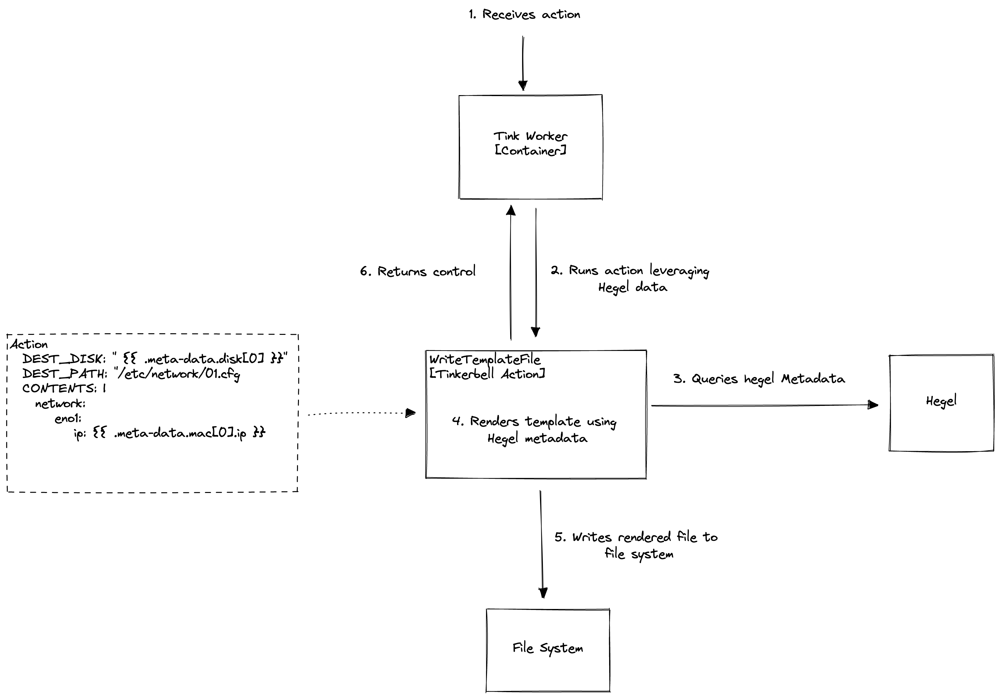

## Summary

Hegel is an instance metadata service. It serves instance metadata over an API (often HTTP) based on the requester IP address (source address). The kind of information it serves include host name, IP addresses, and instance IDs. The data served can be used by consumers to configure the instance. For example, cloud-init parses instance metadata into a format that can be used by user-data scripts when executed by cloud-init.

Currently, Hegel exposes [Equinix Metal instance metadata](https://metal.equinix.com/developers/docs/server-metadata/metadata/). This metadata standard is useful, but is constrained in the extent it can be modified or configured because of its compliance to the Equinix metal instance metadata standard.

We want to develop a new Hegel metadata API that compliments Tinkerbell more generally and can be extended as necessary, while continuing to support Equinix’s metadata standard. The extensibility of an independent Hegel metadata API will enable introduction of data, such as disk information, that creates increased flexibility in template generation as they become machine agnostic.

## Goals and non-Goals

Goals

* Implement a new toggleable API for Hegel, Tinkerbell's metadata service
* Maintain backwards compatability with the Equinix API
* Create an API that can be versioned and iterated upon
* Refactor some of the existing Hegel metadata architecture to make it simpler

Non-Goals

* Completely replace existing API
* Overhaul the overall architecture of Hegel

## Content

This content contains implementation details about the API. Futher details about the API itself are found in the [API section](##APIs). 

### Default API, Toggleability and Configuration

To maintain backwards compatibility with the existing Equinix focused API will be exposed by default. This includes the HTTP and gRPC endpoints. We will look to change the default API in the future.

APIs will be togglable based through CLI or environment variable configuration that compliment the existing implementation. Only the default APIs or the Hegel metadata API will be served at any one time. This aids in avoiding confusion.

The API being served will be exposed via the `/versions` endpoint.

### Versioning

Endpoints are versioned using a single number. When new endpoints are released the version number will be incremented. In most circumstances, we should strive to maintain existing endpoints in subsequent versions. The version number is not semantic.

### Refactoring

The code currently claims EC2 instance metadata compliance. [Given this is inaccurate](https://github.com/tinkerbell/hegel/issues/61#issuecomment-1120483426) we will make the necessary corrections to names. We will look to introduce a new [set of filters](https://github.com/tinkerbell/hegel/blob/main/http/handlers.go#L28) for the Hegel metadata and [refactor existing HTTP handlers](https://github.com/tinkerbell/hegel/blob/main/http/handlers.go#L163) to be generalized. The new handler will be used as the business logic for serving both existing APIs and the new API. 


## System-context-diagram

_(How does this feature or discussion fit into the big picture? Tinkerbell, like
many other modern software stacks, have a high level of interaction between
component, including external components. A system context diagram helps the
reader visually understand how this Proposal plays a role.)_

As a use-case, we intend to create custom Tinkerbell actions after updating Hegel. It will require some effort to make the Hegel metadata available, but once this is done, one very useful and simple action would query all Hegel metadata and render it into a file that could be indexed. This could be used to write any arbitrary template in Tinkerbell. 

*Example:*
```yaml
image: WriteTemplatesFile
params:
    DISK: "{{ .disks[0] }}"
    PATH: /etc/network/01-tinkerbell.cfg
    CONTENTS: |
        network:
            eno1:
                ip: {{ ."1a:1a:1a:1a:1a".ipv4[0].ip }}
                netmask:  {{ ."1a:1a:1a:1a:1a".ipv4[0].netmask }}
```

The following is a diagram depicting how a Tinkerbell will leverage Hegel related to the use-case above. 



## APIs

The following table details the endpoints of instance metadata. Some of the endpoints include placeholders for data that is unique to your instance. 

|Endpoint|Description|Version|
|--------|-----------|-------|
|/v0/meta-data/||	|
|/v0/meta-data/hostname|The hostname of the instance.|	v0|
|/v0/meta-data/`<mac>`/ipv4/`<index>`/ip	|The IPv4 interface for the interface.	|v0|
|/v0/meta-data/`<mac>`/ipv4/`<index>`/netmask	|The subnet mask for the IP configuration.	|v0|
|/v0/meta-data/`<mac>`/ipv6/`<index>`/ip|The IPv6 address for the interface.	|v0
|/v0/meta-data/`<mac>`/ipv6/`<index>`/netmask	|The subnet mask for the IP address.	|v0
|/v0/meta-data/gateway|The instance gateway IP address.	|v0
|/v0/meta-data/disks/`<index>`|Information about a single disk such as device name. For example, /dev/sda	|v0
|/v0/meta-data/ssh-public-keys/`<number>`|SSH keys for the instance.|	v0
|/v0/user-data	|User-data of the instance.	|v0
|/v0/vendor-data	|Vendor-data for the instance.	|v0

### Response Structure

When a query to `/v0/meta-data` is dispatched, we return all fields newline-separated that are retrievable from that endpoint. Based on feedback from the Tinkerbell community, we might need to validate cloud-init behavior. Trailing slashes supposedly influence how the data is built in cloud-init.

*Example*:
```
curl https://<example>:50061/v0/meta-data
>
hostname
<mac>
gateway
disks
ssh-public-keys
user-data
vendor-data
```

### JSON Responses

If you send a `/v0/meta-data` request with a `Accept: application/json` header we return a complete json response. As a stretch goal, a json object will be returned for any endpoint that is dispatched with the `Accept: application/json` header. 

*Example:*
When a query to `/v0/meta-data/<mac>` is dispatched, where `<mac>` is a valid mac address, the following json object would be returned. 
```json
{
   "ipv4": [
     {
       "ip": ...
       "netmask": ...
     }
   ],
   "ipv6": [
     {
       "ip": ...
       "netmask": ...
     }
   ]
}
```

## Alternatives

### Using existing API definitions vs creating our own 

This section details the tradeoffs between adopting existing metadata standards such as ec2 instance metadata (https://docs.aws.amazon.com/AWSEC2/latest/UserGuide/ec2-instance-metadata.html) categories and creating our own metadata API. We are primarily considering the ec2 instance metadata standard rather than other metadata standards because it is a set of conventions specific to AWS that is moderately compatible with Tinkerbell and our team EKS-A. Other metadata standards are not mentioned in detail, but they may be considered.

The EC2 instance metadata standard is an attractive API to model the Hegel API off of because compliance with an existing metadata standard aids longevity and maintainability for the future. Someone will have to maintain and update the Hegel API and creating a custom API for Hegel means that there’s no documentation currently written and certain trade-offs must be made when designing the API, which require interpretation by other developers. 

Indeed, designing endpoints can be difficult. Already we had to debate whether we wanted to index the ipv4 and ipv6 endpoints with <interface> or <mac-address>, which already differs from the existing API which doesn’t require any index to access ipv4 and ipv6 endpoints. Our implementation is trying to support multiple network interfaces, and so we’ve had to make a design decision regarding this. 

While designing a new API is certainly challenging, if we decided to stick with the ec2 instance metadata standard, we’d be unable to customize or add new endpoints as we saw fit. We already know about a use-case in eks-a where we would like to expose disk information, but that isn’t supported in the ec2 standard. Appending custom endpoints to the existing ec2 standard results in a sort of Frakenstein metadata standard, which violates rules of strict metadata compliance. This is orthogonal to the concern that not all ec2 metadata endpoints are relevant to Tinkerbell or eks-a. Among several other endpoints, ami-id and iam role information are unrelated to our hardware instance metadata. This stems from the fundamental issue with the ec2 metadata standard in that ec2 is a cloud-compute service, so the ec2 standards are tailored to metadata needed for cloud services. Tinkerbell and eks-a are on-premises tools. 

The greatest advantage in creating a new, custom Hegel API is that a custom API is subject to updates and evolution independently from other APIs, allowing us to tailor our needs. Additionally, we are proposing a feature to toggle other APIs, such as the Equinix metal instance metadata API, so that Hegel doesn’t immediately become reliant on the new API. 

Implementing a custom metadata API does not remove the possibility of implementing EC2 metadata in the future.

